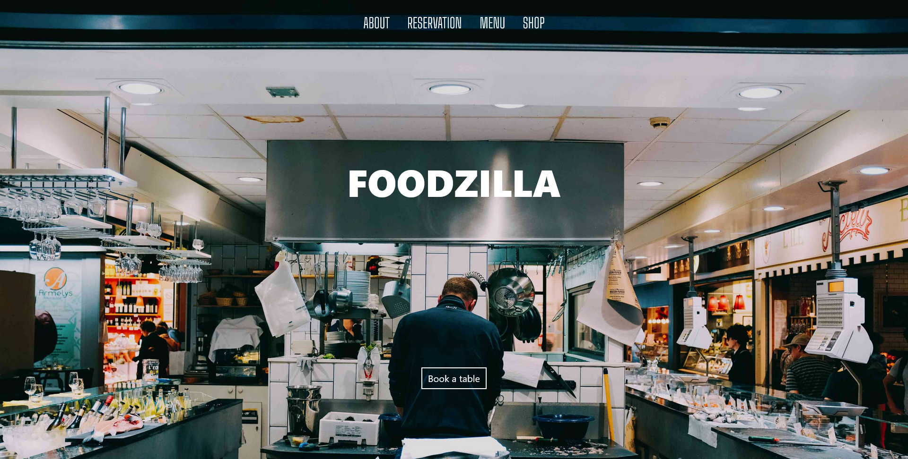
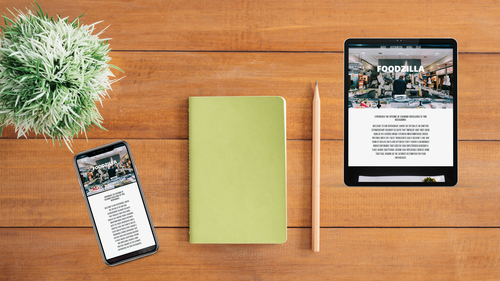

    

<h1 align = "center"><b>Restaurant Website</b></h1>

    <a href="https://restaurant-website-sahadcmd.vercel.app/" target="_blank">Visit Website</a>
    ·
    <a href="https://github.com/sahadcmd/Restaurant-Website/issues" target="_blank">Report Bug</a>
    ·
    <a href="https://github.com/sahadcmd/Restaurant-Website/issues" target="_blank">Request Feature</a>

This Restaurant website boasts a cutting-edge responsive design, meticulously crafted to deliver an unparalleled browsing experience that remains consistent across various devices. Whether you're browsing on a desktop, laptop, tablet, or smartphone, this website adapts seamlessly to the screen size, ensuring optimal usability and visual appeal.

The user-friendly interface of this website makes it effortless for customers to navigate and with just a few clicks, patrons can easily make reservations and book their desired dining experience directly online.

 

## Preview

    

 
 

    

<h5 align="center">Connect with me!</h5>

    

